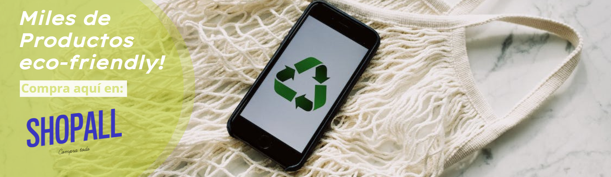

# ShopAll - Tu Marketplace Eco-Amigable 🌱🛍️

¡Bienvenido a ShopAll! Nuestra plataforma de comercio electrónico está comprometida con la oferta de productos eco-amigables y sostenibles. Descubre una amplia variedad de productos que ayudarán a reducir tu impacto ambiental.

## Características Destacadas 🌟

- Amplia selección de productos ecológicos.
- Navegación intuitiva y experiencia de compra optimizada.
- Carrito de compras con calculadora de huella de carbono integrada.
- Detalles de sostenibilidad para cada producto.
- Opciones de pago seguras y respetuosas con el medio ambiente.

## Capturas de Pantalla 📷

## Cómo Contribuir 🤝

¡Agradecemos tus contribuciones! Si deseas colaborar en ShopAll, sigue estos pasos:

1. Haz un fork de este repositorio.
2. Crea una rama para tu función o corrección: `git checkout -b nueva-funcion`.
3. Realiza tus cambios y realiza un commit: `git commit -m 'Agrega nueva función'`.
4. Sube tu rama: `git push origin nueva-funcion`.
5. Abre un Pull Request en GitHub.

## Licencia 📄

Este proyecto está licenciado bajo la Licencia MIT. Para obtener más detalles, consulta el archivo [LICENSE](LICENSE).

¡Gracias por elegir ShopAll y por apoyar un estilo de vida sostenible! ♻️🌍
